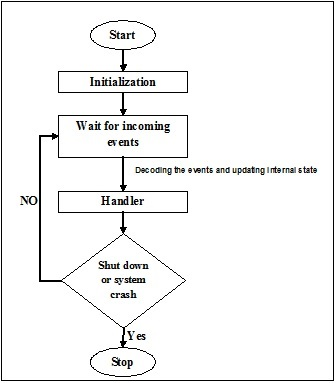

## Event Driven Programming

1. What native Node.js module allows us to get started with Event Driven Programming?

In Node.js, the native module that allows us to get started with Event Driven Programming is the "events" module. This module provides an EventEmitter class that serves as the foundation for creating and handling events in Node.js applications. It allows you to define custom events and bind functions (known as event listeners or event handlers) to those events. By emitting or triggering events, you can notify and invoke the associated event handlers.
_ _ _
2. What is the value of Object Oriented Programming used in tandem with Event Driven Programming?

Object-oriented programming (OOP) can be valuable when used in tandem with Event Driven Programming. OOP provides a way to organize and structure code by creating objects that encapsulate data and behavior. When combined with Event Driven Programming, OOP allows you to define event-driven systems in a more modular and maintainable manner. Objects can represent entities in your application, and events can trigger methods or functions within those objects, making it easier to manage the complexity of event handling and maintain code coherence.
_ _ _
3. Consider your knowledge of Event Driven Programming in the Web Browser, now explain to a non-technical friend how Event Driven Programming might be useful on the backend using Node.js.

Let's say you're building a chat application. With event-driven programming in Node.js, you can define events such as "new message received" or "user joined." When a user sends a message or joins the chat, an event is emitted. These events can be handled by functions or methods that perform actions such as storing the message in a database, notifying other users, or updating the chat interface in real-time.

Event-driven programming in Node.js allows you to handle multiple events concurrently without blocking the application's execution. It enables your backend to be responsive and scalable, as it can handle numerous incoming events simultaneously. This makes it well-suited for applications that require real-time updates, asynchronous processing, and efficient resource utilization.

By leveraging event-driven programming on the backend, Node.js applications can handle a large number of concurrent requests efficiently, making them suitable for building scalable and responsive web applications, APIs, and other server-side systems.

_ _ _
