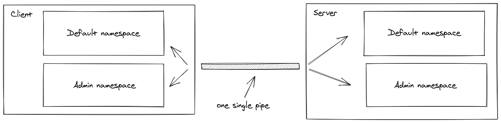

# Message Queues

1. Explain to a non-technical recruiter what the Chat Example (above) does.
it is a real-time chat application built using Socket.IO, a JavaScript library for enabling real-time, bidirectional communication between a server and multiple clients.
_ _ _
2. What proof of life are we getting on the backend from the above app?
we can get a proof of life on the backend by monitoring the connection events between the client and the server and print "connect" on console.
_ _ _
3. Socket.IO gives us the i0.emit() method to send an event to everyone. What flag would you use if you want to send a message to everyone except for a certain emitting socket?
 broadcast flag along with the except option.
 io.emit('event', data, { broadcast: true, except: socketId });
_ _ _
_ _ _
## Rooms:
1. What is a room and how might a room be useful?
- a room is an arbitrary channel or grouping mechanism that allows you to organize connected sockets. Sockets can join and leave rooms dynamically, and you can use rooms to broadcast events to a specific subset of clients.

-  rooms provide a flexible and powerful mechanism to organize and manage the communication between sockets in Socket.IO applications. They allow you to target specific groups of sockets, improve scalability, and enhance the overall efficiency and security of your application.

_ _ _ 
2. How do you join a room?
socket.join('roomName');
_ _ _
3. how do you leave a room?
socket.leave('roomName');

_ _ _

_ _ _
_ _ _
## Namespaces
1. What is a Namespace and what does it allow you to do?
In Socket.IO, a namespace is a logical separation or grouping of sockets and events within a Socket.IO server. It allows you to create multiple communication channels or endpoints within a single server instance.
(in other words): A Namespace is a communication channel that allows you to split the logic of your application over a single shared connection,also called "multiplexing.
_ _ _
2. Each namespace potentially has its own what? (hint: 3 things)
- rooms
- Event handlers
- middlewares
_ _ _
3. Discuss a possible use case for separate namespaces.
A possible use case for separate namespaces in Socket.IO is a multi-tenant application where each tenant requires its own isolated communication channel.
In a multi-tenant application, different organizations or users (tenants) may be using the application concurrently. Each tenant needs a separate communication channel to ensure data privacy, security, and segregation of events.
_ _ _

