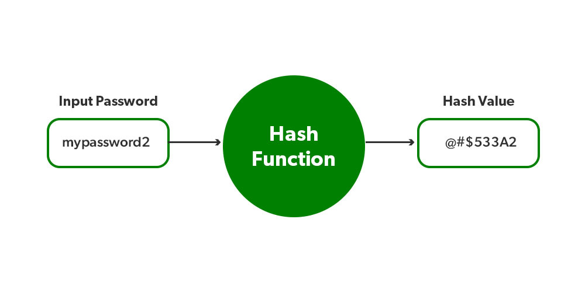
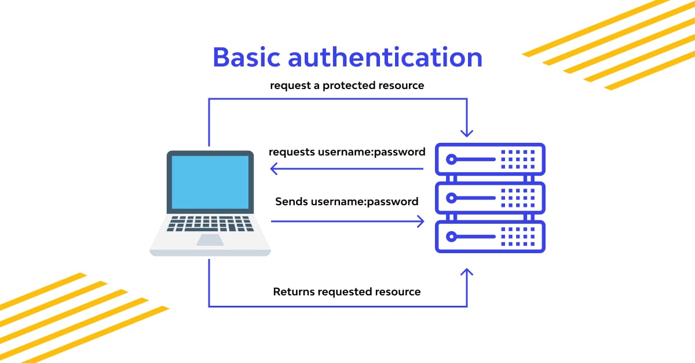

## Securing Passwords
1. Explain to a non-technical friend how you would safely hash and store a password.
Step 1: Hashing the Password
Hashing is a process of converting a password into a unique string of characters that cannot be reversed to obtain the original password. It's like putting the password through a one-way mathematical function. The output of this function is called the hash. A good hashing algorithm takes the password and produces a fixed-length hash, regardless of the password's length.

Step 2: Adding Salt
To enhance security, we add an additional step called salting. A salt is a random string of characters that is added to the password before hashing. The salt value is unique for each user. Salting makes it much more difficult for attackers to crack passwords using precomputed tables, called rainbow tables, which are essentially large databases of precomputed hashes for commonly used passwords.

Step 3: Storing the Hashed Password
Instead of storing the actual password, we store the hashed password along with the salt value. This way, even if an attacker gains access to the stored data, they won't be able to retrieve the original passwords.

Step 4: Verifying Passwords
When a user tries to log in, we repeat the process. We retrieve the hashed password and the corresponding salt value from the storage, then hash the entered password with the same salt. We compare the newly generated hash with the stored hash. If they match, the entered password is correct.

By following these steps, we ensure that even if someone gains unauthorized access to the stored password data, they won't be able to retrieve the original passwords easily. It adds an extra layer of security and helps protect user accounts from being compromised.

2. What is Bcrypt?
Overall, Bcrypt is a robust and widely trusted hashing algorithm that provides a high level of security for password storage. Its adaptive nature, automatic salting, key stretching, and fixed-length output make it a strong choice for protecting user passwords and defending against various types of attacks.

3. Why might you use something like Bcrypt?
By using Bcrypt,i can significantly enhance the security of password storage, protect against various attack vectors, comply with security standards, and provide my users with a higher level of confidence in the protection of their passwords and accounts.

___________________________________________________________________________________________________________
## Basic Auth
1. What is Basic Authentication?
Basic Authentication is a simple and widely used method of user authentication over HTTP. It is an older authentication scheme that is based on sending credentials in plaintext. 
It's important to note that Basic Authentication does not provide strong security. The main limitation is that the credentials are sent with each request in plaintext, making them vulnerable to interception and unauthorized access if the communication channel is not secured using encryption (e.g., HTTPS).
Due to its inherent security risks, Basic Authentication is generally not recommended for transmitting sensitive information over the internet.

2. What properties are necessary in the header of a Basic Auth request?
- Authorization
- Content-Type

3. How are username:password in Basic Auth encoded?
by Base64 Encoding: Convert the concatenated string  into Base64 encoding. Base64 encoding converts binary or text data into ASCII characters. The resulting encoded string represents the username and password in a format that can be transmitted as part of the HTTP header.

___________________________________________________________________________________________________________
## OWASP auth cheatsheet
1. Define the authentication process to a non-technical recruiter.
Authentication is the process of verifying and confirming the identity of someone or something. In the context of computer systems and online services, authentication is used to ensure that only authorized individuals or entities can access certain resources or perform specific actions.

2. How should your error messaging respond (both HTTP and HTML)? Why?
it is important to provide clear and informative messages to users.
- HTTP Error Messages:

 * Status Codes: HTTP status codes are used to indicate the outcome of a request. Different status codes convey different meanings. For example, a "200 OK" status code indicates a successful request, while a "404 Not Found" status code indicates that the requested resource was not found. By using appropriate status codes, you can convey the outcome of the request to the client.

 * Error Details: In addition to the status code, it is beneficial to include additional information about the error. This can be done by including an error message or error description in the response body. The error message should provide meaningful information about what went wrong, such as "Invalid username or password" or "Access denied." Including such details helps users understand the issue and take appropriate action.

- HTML Error Messages:

 * User-Friendly Messages: When displaying error messages in HTML, it's important to make them user-friendly and easy to understand. Clear and concise messages that explain the issue in simple terms are more helpful to users than technical jargon. For example, instead of displaying a generic error like "500 Internal Server Error," you could show a message like "Oops! Something went wrong. Please try again later."

 * isual Presentation: Consider the visual presentation of the error message to make it noticeable and distinguishable from regular content. You can use different colors, styling, icons.

 * Guidance and Instructions: Along with the error message, you can provide guidance or instructions on how to resolve the issue or suggest alternative actions.

 3. Bookmark this link also and consider OWASP fundamentals any time you interact with authentication. Applications developed with security in mind from inception have fewer vulnerabilities throughout their lifecycle.
 https://www.npmjs.com/package/bcrypt

 _________________________________________________________________________________________________________

