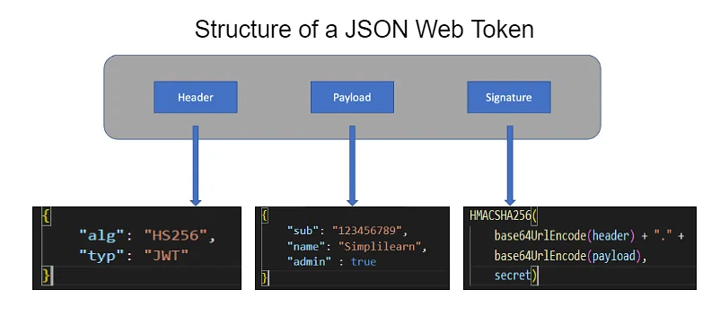

## Bearer Authorization
### Intro to JWT
1. What is a JSON Web Token (JWT)?
    A JSON Web Token (JWT) is an open standard for securely transmitting information between parties as a JSON object. It consists of three parts: a header, a payload, and a signature. JWTs are commonly used for authentication and authorization purposes in web applications and APIs.
2. When should we use JSON Web Tokens?
    JSON Web Tokens (JWTs) are typically used in the following scenarios:
    1. User authentication: JWTs can be issued upon successful user login and used to authenticate subsequent requests, eliminating the need for session storage on the server side.
    2. API authorization: JWTs can contain authorization claims, allowing APIs to validate and authorize access based on the information within the token.
    3. Single sign-on (SSO): JWTs can be used to enable SSO across multiple applications or services by sharing authentication information between them.
3. Claims are expected in which structural component of a JWT?
    Claims are expected in the payload component of a JSON Web Token (JWT). The payload is a JSON object that contains the claims, which are statements about the user or additional data. Claims can include information like user ID, roles, permissions, expiration time, and custom data relevant to the application.
_________________________________________________________________________________________________________
### Are JWTs Secure?
1. If I get a JWT and I can decode the payload, how can we call that secure?
    While JWTs can be decoded to read the payload, their security relies on the signature verification process. The signature ensures the integrity and authenticity of the token, preventing tampering. Without the private key, an attacker cannot forge a valid signature, making the token secure against unauthorized modifications.
2. If sending a JWT, what must sender and receiver both know? Hint, it’s appended in the signature.
    When sending a JWT, both the sender and receiver must know the shared secret key or have access to the public key if asymmetric cryptography is used. The secret or public key is used to verify the signature appended to the JWT, ensuring the integrity and authenticity of the token.
3. Explain how concatenated content and secret can be sent and received securely to a non-technical recruiter.
    Concatenated content and secret can be securely sent to a non-technical recruiter by using a secure communication channel like encrypted email or a secure file sharing service. The sender should share the secret separately (e.g., through a phone call) to ensure confidentiality. The recipient can then use the provided secret to extract and validate the content.
_________________________________________________________________________________________________________
### JWTs Explained
1. Why use JWT?
    There are several reasons to use JSON Web Tokens (JWTs):
    1. Stateless: JWTs are stateless tokens, meaning the server does not need to store session information. This reduces server-side overhead and enables scaling of distributed systems.
    2. Authentication and Authorization: JWTs can be used for user authentication and authorization. They securely carry information such as user roles, permissions, and claims, allowing servers to make authorization decisions without additional database queries.
    3. Security: JWTs use digital signatures or encryption to ensure the integrity and confidentiality of the token. This prevents tampering and unauthorized access to the token contents.
    4. Cross-Domain and Microservices: JWTs are well-suited for cross-domain and microservices architectures. They can be easily shared across different domains or services, enabling seamless communication and SSO (Single Sign-On) capabilities.
    5. Lightweight and Interoperable: JWTs are lightweight, compact, and represented in a JSON format, making them easy to generate, transmit, and parse across different programming languages and platforms. They are widely supported and have libraries available for various programming languages.
2. JWT is Compact and self-contained. Describe how this is useful to a non-technical friend.
    JWT being compact and self-contained means it can be easily transmitted as a single string without additional dependencies or server-side storage. This simplifies integration and reduces overhead, making it convenient to use and understand for non-technical individuals, while securely carrying necessary information within the token.
3. What are the three components (the structure) of a JWT signature?
    The JWT signature consists of three components:
    1. Header: The header component of the signature contains information about the algorithm used for signing the token. It is a JSON object that typically includes the "alg" (algorithm) parameter.
    2. Payload: The payload component of the signature contains the claims or statements about the user or additional data. It is also a JSON object that holds information such as user ID, expiration time, roles, and custom data.
    3. Signature: The signature component is the result of hashing the concatenated string of the base64-encoded header and payload along with a secret key (or private key in asymmetric cryptography). It ensures the integrity of the token and can be used to verify its authenticity.
___________________________________________________________________________________________________________
